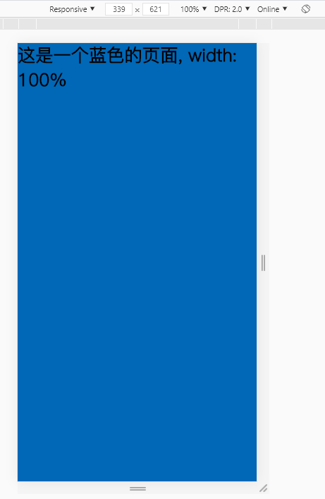

## 问题描述
用chrome调试手机端页面时, 经常会用到 device mode (ctrl + shift + m)

设置元素宽度为100%之后, 用 Responsive 模式逐步缩小设备宽度, 当宽度接近320px时, 页面右侧会出现一个白色间距, 并且随着宽度变小, 间距也会增大, 严重影响开发调试的体验

### 未触发时, 页面显示正常


### 当宽度继续变小, 右侧出现白边


这个 bug 在不打开 device mode 时不会出现, 且无法在页面css中找到关于白边的线索, 在中文搜索引擎中未能找到相关问题的描述

## 解决方法
解决方法非常魔幻, 不知道为什么能够解决这个问题, 也不懂得这个问题产生的原理
```
html, body {
    overflow-x:hidden;
}
```

> 解决方法来自 [参考链接](https://stackoverflow.com/questions/19148836/my-site-shows-white-space-on-right-in-mobile-chrome-but-not-desktop-chrome)
